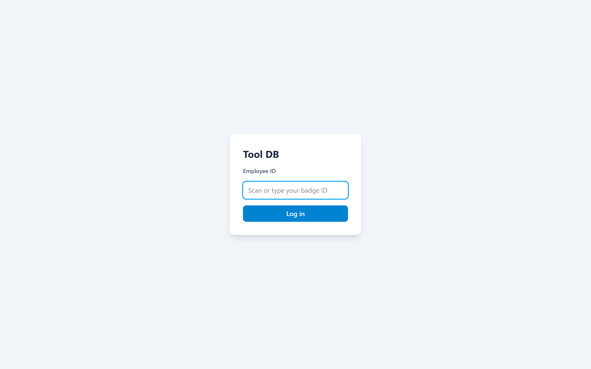
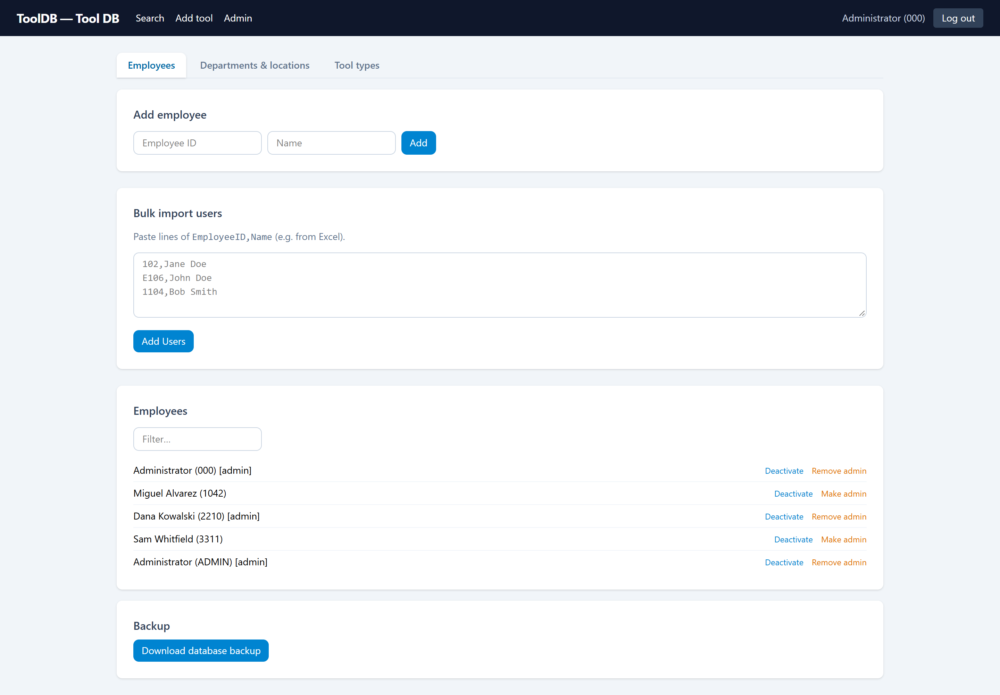
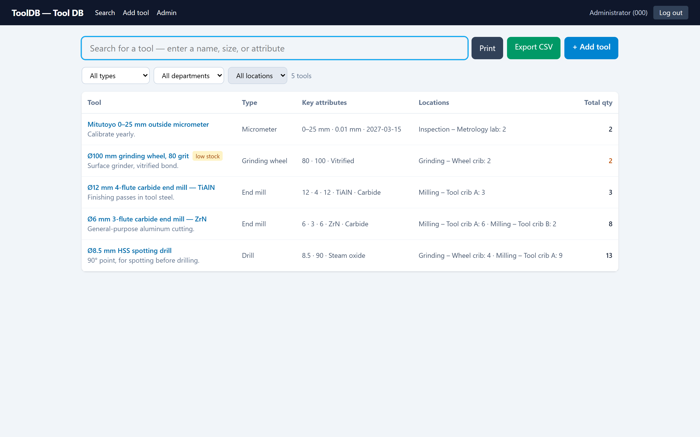
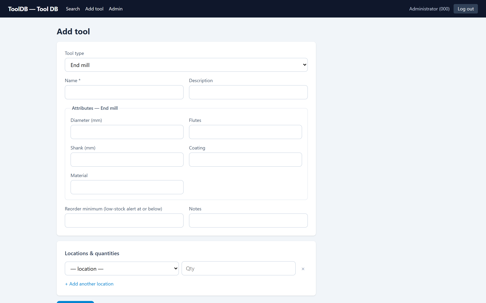
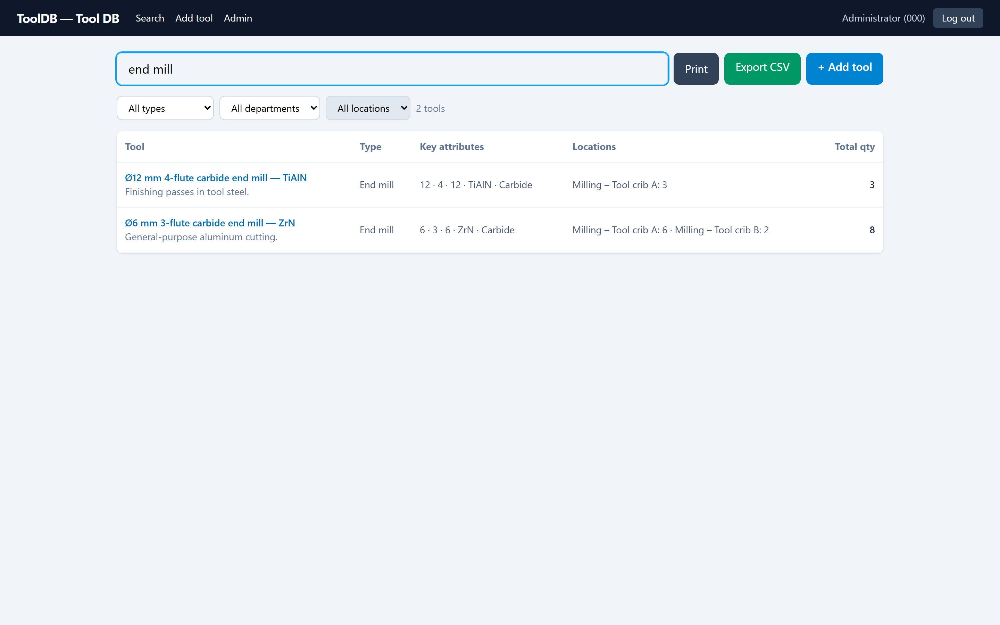
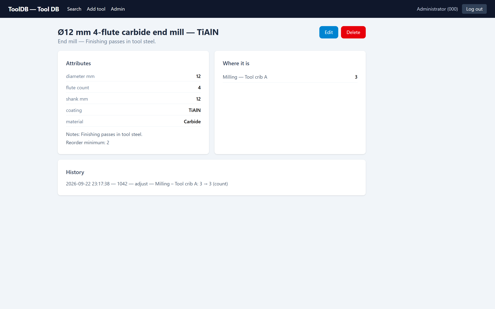
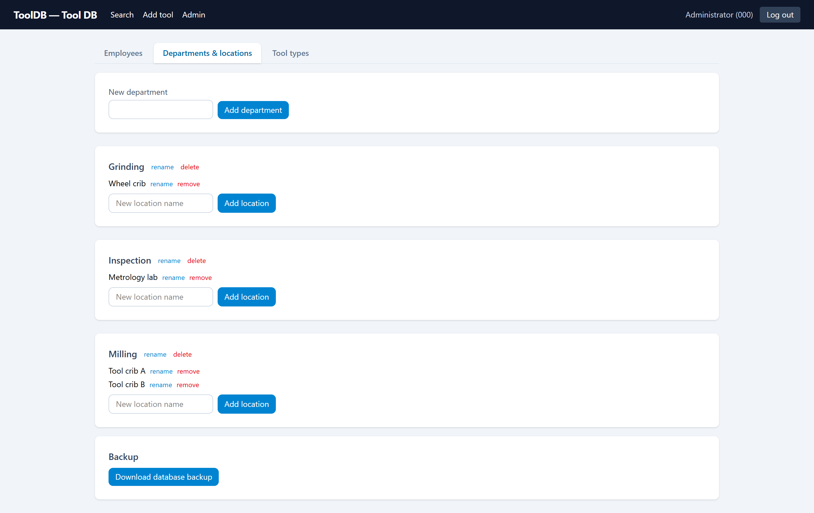
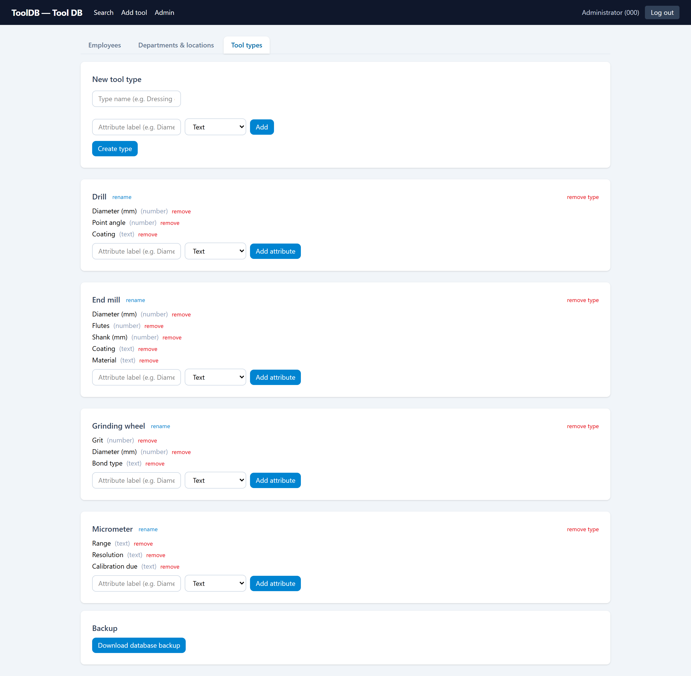

# Tool DB — CNC Tool Tracking (Python)

[](https://github.com/BraynerSantos/tool-tracking/actions/workflows/ci.yml)
[](LICENSE)

A self-hosted tool-tracking web app: employees log in with their badge ID,
search tools by name/attribute/description, and see quantities per location.
Admins manage employees, departments, locations, tool types (with custom
attributes), export CSV, print filtered lists, and download SQLite backups.

Python (FastAPI + uvicorn + SQLite) rewrite of the original Node app, shipped
as a single portable Windows folder — no Node, no Python install needed on the
server PC.

## Screenshots
| Badge login | Admin — employees |
| --- | --- |
|  |  |

| Inventory with low-stock alert | Add-tool form with type-specific attributes |
| --- | --- |
|  |  |

| Search (filtered) | Tool detail |
| --- | --- |
|  |  |

| Admin — departments & locations | Admin — tool types |
| --- | --- |
|  |  |

## Deploy (Windows, no installer)

Everything the server needs is in the `dist\ToolDB` folder after a build:

```
dist\ToolDB\
  ToolDB.exe        <- double-click / Task Scheduler entry point
  _internal\        <- runtime + bundled UI (do not edit; keep next to the exe)
  docs\             <- user/admin/troubleshooting guides (plain text)
```

To deploy:

1. Copy the whole `dist\ToolDB` folder to the server PC, e.g. `C:\tooldb`
   (keep `ToolDB.exe` and `_internal\` together).
2. Run `ToolDB.exe`. It runs in the background — no terminal window opens.
   Diagnostics are written to `tooldb.log` next to the exe.
3. Employees open `http://<server-ip>:3000`.

## Documentation

The `docs\guides` folder (copied into `dist\ToolDB` on build) contains:

- **UserGuide.md** — how the app works and how to do everyday tasks
- **AdminGuide.md** — setup, config.ini reference, roles, backups, auto-start
- **Troubleshooting.md** — symptom → cause → fix for common problems
- **DisasterRecovery.md** — restoring backups, dead-PC migration, lockout recovery

### First run

On first start the exe creates, next to itself:

- `config.ini` — settings file (see below)
- `tooldb.sqlite` — the database, seeded with two bootstrap admin logins,
  **000** and **ADMIN** (both named "Administrator"). No departments, locations
  or tool types exist yet — you create those from the Admin screens.
- `session-secret` — random secret used to sign session cookies

Log in with badge **000** (or **ADMIN**) — both are seeded as admins. Then go
to Admin → Employees and add yourself with your real badge ID and name, plus
the rest of the team. Departments, locations and tool types are created from
the Admin screens — the app starts with none of them.

### config.ini

```ini
[General]
companyname = Acme        ; shown in the app header
port = 3000               ; HTTP port the server listens on

[Database]
databasepath = tooldb.sqlite

[Backup]
backupdir = C:\tooldb\backups
```

- `databasepath` — relative paths resolve against the exe's folder; an
  absolute path (e.g. `D:\data\tools.sqlite`) is used as-is. The folder is
  created if missing.
- `backupdir` — empty disables auto-backup. When set, one dated
  `tooldb-backup-YYYY-MM-DD.sqlite` is written per day shortly after startup,
  and only the newest 30 copies are kept.
- If an auto-backup fails (e.g. the backup folder is unreachable), it retries
  hourly and the failure is recorded in `tooldb.log` next to the exe.

Edit `config.ini` while the server is stopped, then start it again for changes
to take effect.

### Auto-start (optional)

To survive reboots: Task Scheduler → Create Task → trigger "At startup"
(run as the user that should own the data) → Actions → New action:

- Program/script: `C:\tooldb\ToolDB.exe`
- Start in: `C:\tooldb`

### Backups

- Manual: Admin → Download database backup (admin only) saves a copy of the
  SQLite database through the browser.
- Automatic: set `backupdir` as above for daily dated copies (keep 30).
- Belt-and-braces: copy the database file while the server is stopped.

### Sessions

Sessions are signed cookies, not server-side storage — they keep working
across server restarts because the signing secret is the stable
`session-secret` file. Only deleting that file (or replacing it) invalidates
everyone's sessions and forces a fresh login.

## Design decisions

Trade-offs made deliberately for this app's setting — a small shop floor with
one always-on Windows PC as the server. They would be different choices for a
internet-facing app at scale.

**Badge-only login (no passwords).** Employees log in with their badge ID and
no secret. That's a fit for a shop-floor kiosk: the audience is a physically
controlled building, the alternative (passwords for machine operators wearing
gloves) is real friction, and admin actions are gated separately. If the app
were exposed beyond the LAN, a PIN or password per badge would come first.

**One shared SQLite connection behind a lock.** Sync FastAPI endpoints run in
a threadpool, so separate connections per request could interleave transactions
(a 409 raised mid-`with conn:` in one request would roll back another
request's in-flight writes). Instead every request shares one connection,
handed out under `threading.Lock` by a single dependency
(`app/db.py`), which serializes DB access. At shop scale (a handful of
concurrent users, sub-millisecond queries) the lock is never the bottleneck;
past that, the fix is per-request connections and/or Postgres, not more locks.

**SQLite + WAL, not a database server.** Zero-install, the data is one file
that's trivial to back up (and the app backs it up automatically), and WAL
mode lets readers proceed while a write is in flight. The schema uses real
foreign keys and CHECK constraints, so moving to Postgres later is a migration,
not a rewrite.

**Signed-cookie sessions with a stable secret.** Sessions are itsdangerous
cookies, not server-side storage, and the signing secret lives in the
`session-secret` file. Restarting the server therefore doesn't log everyone
out — only deleting or replacing that file does. `SameSite=lax` cookies plus
a same-origin SPA keep the CSRF surface minimal; there are no cross-site
consumers of the API.

**Shipped as a portable PyInstaller folder, not a service.** The server PC is
managed by non-developers: no Python install, no installer, no admin rights —
copy `dist\ToolDB`, double-click `ToolDB.exe`. Diagnostics go to `tooldb.log`,
auto-start is plain Task Scheduler, and disaster recovery is documented as
"copy the folder, restore a backup file".

## Building from source

```
python -m venv .venv
.venv\Scripts\pip install -r requirements-dev.txt
npm install --prefix client
build_exe.bat
```

`build_exe.bat` builds the React UI into `client\dist`, then runs PyInstaller
with `tooldb.spec`, producing `dist\ToolDB\ToolDB.exe`.

## API tests

The API test suite lives in `tests\` and runs against a throwaway database:

```
.venv\Scripts\python -m pytest -q
```

## Development

- `.venv\Scripts\pip install -r requirements-dev.txt` — server deps + test tooling
- `npm install --prefix client` — React/Vite client deps
- `.venv\Scripts\python -m uvicorn app.main:app --reload` — API on port 3000
- `npm run dev --prefix client` — Vite dev server (proxies `/api` to 3000)
- `.venv\Scripts\python app\main.py` — production-style run: one server on
  port 3000 serving `client\dist` + API
